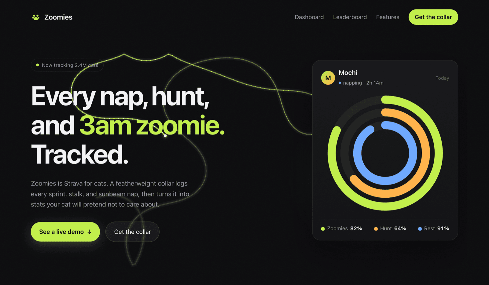
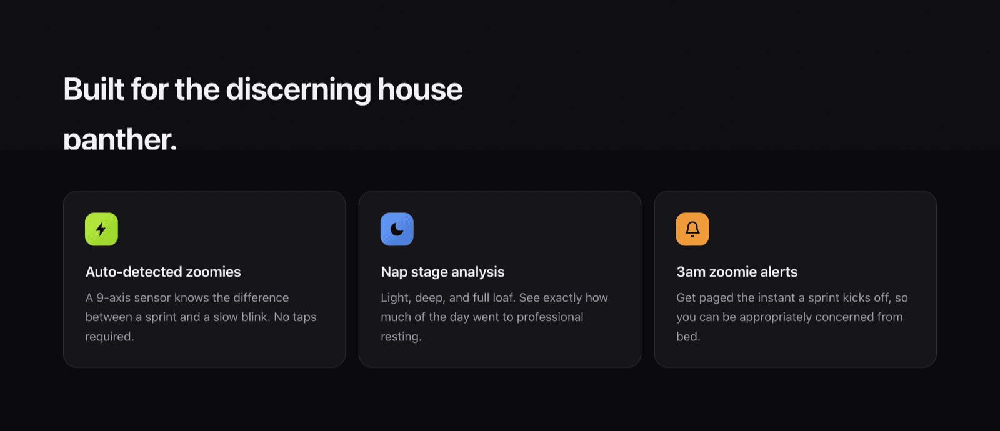
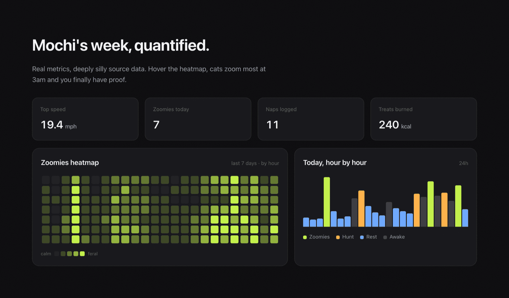
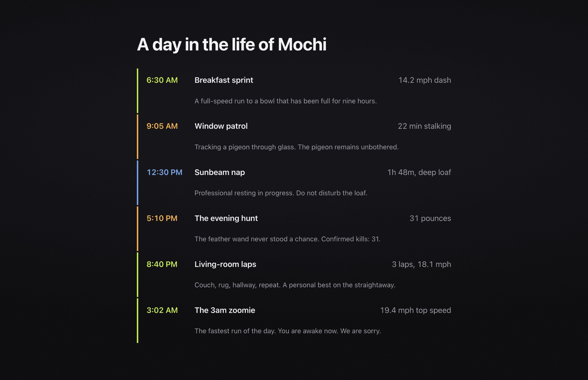
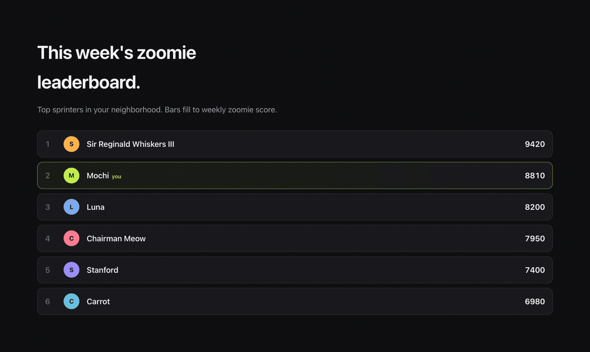

# Zoomies

**Strava for cats.** A featherweight smart collar logs every sprint, stalk, and
sunbeam nap, then turns it into stats your cat will pretend not to care about.

### [Open the live site &rarr;](https://zoomies.garytou.dev/)



> This is an example site built with the
> [high-fidelity-web](https://github.com/garyhtou/claude-plugins) Claude Code
> skill, a demo of the kind of site that skill produces — the site, this repo,
> and this README were all written by Claude Code. Everything below is written
> as the product itself. Zoomies is not a real product (cats remain untrackable
> by design).

---

## The product

### What it is

Zoomies is a wearable activity tracker for cats: a featherweight, waterproof
**Zoomies Collar** plus a companion app. A 9-axis sensor and on-device ML
auto-detect what your cat is actually doing all day, zoomies (sprints), hunts
(stalking and pouncing), naps (with sleep stages), and grooming. No taps, no
guessing.

The app turns it into the things quantified-self people already love: **activity
rings**, an hourly **zoomies heatmap**, neighborhood **leaderboards**, health
**insights**, and real-time **3am zoomie alerts**.

### Why

You leave in the morning and have no idea what your cat does for the next nine
hours. Zoomies answers three questions at once:

- **Connection.** What does my cat actually do all day?
- **Reassurance.** Is my cat healthy and behaving normally? Anomaly detection
  flags sudden lethargy or hyperactivity and nudges a vet visit.
- **Bragging rights.** Mochi hit 19.4 mph at 3:02am. The leaderboard knows.

It is the quantified-self category (Whoop, Oura, Strava, Apple Fitness) pointed at
the most committed athlete in the home: the cat. Premium hardware, real data
science, and a completely straight face about deeply silly source data.

### Features

- **Auto-detected activities.** 9-axis sensor plus on-device ML classifies
  zoomies, hunts, naps, and grooming. No taps.
- **Activity rings.** Daily Zoomies, Hunt, and Rest goals that close as the day goes.
- **Zoomies heatmap.** Intensity by hour and day. The 3am pattern is real, and now
  provable.
- **Nap stage analysis.** Light, deep, and full loaf, with daily totals.
- **3am zoomie alerts.** Real-time push the instant a sprint starts.
- **Leaderboards.** Neighborhood, breed, and household rankings by weekly zoomie score.
- **Health insights.** Anomaly detection as an early-warning signal.
- **Performance stats.** Top speed, distance, and a "treats burned" calorie estimate.



### The hardware

Featherweight, waterproof Zoomies Collar. 30-day battery. Breakaway safety clasp.
Three colors: Midnight, Sand, and Zoomie Lime.

### Pricing

- **Collar** &middot; $99 one-time.
- **Free** &middot; rings and basic daily stats.
- **Zoomies+** &middot; $9/mo for full history, heatmaps, insights, and anomaly alerts.

### Who it is for

The Quantified Cat Parent: already wears an Apple Watch or an Oura ring, loves
their cat intensely and a little ironically, and wants to know what the little
athlete does while they are at work. Multi-cat households get a leaderboard. Vets
get an activity history.







The full brand and product profile (positioning, ICP, voice, and the color system)
lives in [`BRAND.md`](BRAND.md).

---

## The build

A single static site. No framework, no bundler, no build step: open `index.html`
and it runs. The goal was an awwwards-grade bar with vanilla tools, and to keep
every effect meaningful rather than decorative.

### Stack

- **Vanilla HTML, CSS, and JavaScript.** One stylesheet, one script.
- **GSAP + ScrollTrigger** (from a CDN) for the one pinned, scroll-scrubbed scene.
- **Canvas 2D** for the hero animation. No WebGL; no images beyond the three
  preview stills above.

### The interesting parts

- **The cursor-chasing zoomie trail** (the hero) is a Canvas 2D runner that wanders
  the hero like a tracked sprint and loosely curves toward your cursor: the cat
  chasing you. It visualizes the exact thing the product sells. The steering is
  eased (no jitter, no hard edge bounces), and the loop pauses when the tab is
  hidden or the hero scrolls offscreen.
- **Activity rings** animate by tweening SVG `stroke-dashoffset`; hover a ring or
  its legend to isolate one metric while the others dim.
- **The zoomies heatmap** is a JS-sized grid of uniform square cells with
  contiguous hover targets (no dead gaps), a tooltip per cell, and a week of data
  with an actual story in it: a nightly 3am spike, a feral weekend, and a
  suspiciously quiet Wednesday afternoon at the vet.
- **The hourly timeline** colors each hour by category and focuses the bar you hover.
- **"A day in the life"** is a pinned, scroll-scrubbed scene: the sun arcs across
  the sky and each moment of the day crossfades in as you scroll. On small screens
  and under reduced motion it degrades to a plain, readable list.
- **Cursor-reactive 3D tilt cards**, **count-up metrics**, an **animated
  leaderboard**, and a **magnetic CTA** round it out.

### Built to be reliable, not just pretty

- One-shot reveals fire on `IntersectionObserver`, not cached scroll positions, so
  they never get stuck hidden.
- Color is used for meaning (lime = zoomies, blue = rest, amber = hunt), not
  decoration.
- Full `prefers-reduced-motion` support: every animation has a calm or static
  fallback.
- Mobile-first and responsive: no horizontal overflow, and the immersive effects
  degrade on phones.

### Run it locally

```sh
git clone https://github.com/garyhtou/zoomies
cd zoomies
python3 -m http.server
# then open http://localhost:8000
```

### Structure

```
zoomies/
├── index.html     # markup
├── styles.css     # design tokens + all styling
├── app.js         # every interaction and animation
├── BRAND.md       # the fictional product profile
└── preview/       # the stills in this README
```

---

<sub>A demo build. Not a real product. Cats remain untrackable by design.</sub>
